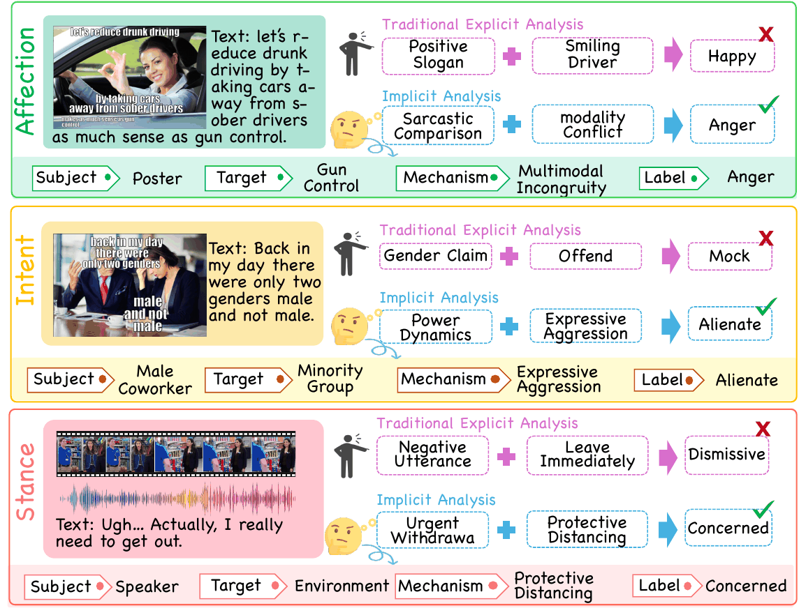
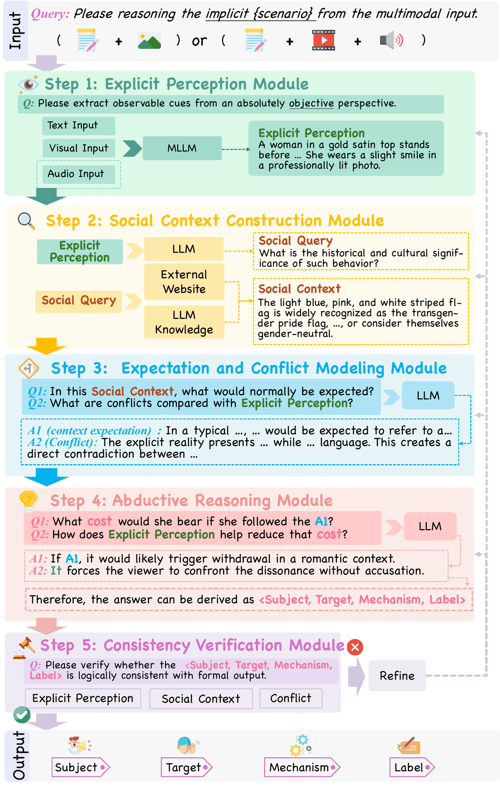
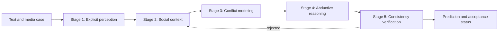

<div align="center">

# MoCA: Implicit Social Context Analysis

**A benchmark and reference reasoning pipeline for recovering implicit social meaning from multimodal evidence**

[](LICENSE)
[](https://huggingface.co/datasets/z4722/Implicit_dataset)
[](pyproject.toml)
[](https://huggingface.co/datasets/z4722/Implicit_dataset)



</div>

MoCA (**I**mplicit **So**cial **C**ontext **A**nalysis) is a task, benchmark, and reference reasoning framework for a question that explicit-cue models routinely miss: given a piece of multimodal evidence, **who** expresses **what** toward **whom**, and **through which social mechanism** is that latent meaning conveyed? MoCA covers three complementary scenarios — **affection**, **intent**, and **stance** — and pairs 3,108 real-world multimodal instances with fine-grained cognitive annotations.

State-of-the-art multimodal LLMs struggle on MoCA because they lean on explicit surface cues and lack a mechanism for reasoning over latent social context. To close this gap we introduce **CoDAR** (**Co**nflict-**D**riven **A**bductive **R**easoning), a five-stage framework that treats the discrepancy between an observed expression and the expectation-aligned "truthful" expression as a *cognitive conflict*, then abductively recovers the hidden mental state that explains it.

This repository hosts the benchmark annotations, the CoDAR prompt contracts and pipeline scaffold, data schemas, and representative multimodal cases. Media files are hosted separately on the [MoCA Hugging Face dataset](https://huggingface.co/datasets/z4722/Implicit_dataset).

**Resources:** [Benchmark annotations](data/datasetv3.18_hf_319_no_media_options.json) · [Hugging Face media](https://huggingface.co/datasets/z4722/Implicit_dataset) · [Pinned media snapshot](https://huggingface.co/datasets/z4722/Implicit_dataset/tree/170a5941118de47ec22bf5b7d5253cda25838c43)

---

## Highlights

- **3,108 curated multimodal instances** across affection, intent, and stance, filtered so the correct answer requires genuine cross-modal reasoning (unimodal-only predictions are explicitly screened out).
- **Structured 4-tuple annotation** — `(subject, target, mechanism, label)` — instead of a flat classification label, so both *what is felt* and *how it is expressed* are captured.
- **CoDAR**, a conflict-driven abductive reasoning framework with a five-stage contract (explicit perception → social context → conflict modeling → abductive reasoning → consistency verification) that is directly executable against this repo's pipeline scaffold.
- **Diversity metadata** (social domain, cultural context) attached to every instance for stratified evaluation.
- **Zero hard dependencies** — the schemas and pipeline scaffold are pure Python standard library; only the optional web-search tool needs an API key.

## CoDAR: Conflict-Driven Abductive Reasoning

CoDAR organizes implicit social reasoning into five stages:

<p align="center">
  
</p>

<details>
<summary>Compact stage graph</summary>



</details>

1. **Explicit perception** records text and optional speech captions without assigning social meaning.
2. **Social context** formulates retrieval questions and organizes evidence into `fact`, `connection`, and `social_norm` fields.
3. **Conflict modeling** identifies the deviation between contextual expectation and explicit reality.
4. **Abductive reasoning** recovers the subject, target, mechanism, and latent label from the conflict.
5. **Consistency verification** checks evidence, context, and mechanism alignment. Rejected cases can be revisited for a configurable number of revision rounds.

The prompt contracts for these stages are defined in [`moca/prompts.py`](moca/prompts.py), and the pipeline orchestration is in [`moca/pipeline.py`](moca/pipeline.py).

> **Scope note.** The stage-2 through stage-4 logic shipped in this repository is a schema-complete but intentionally minimal reference scaffold (`ConsistencyCheck.verification_note` literally reports `"Framework mode: detailed modules are omitted."`). It exists to make the CoDAR contract, data structures, and CLI runnable end-to-end, not to reproduce the full model-backed reasoning used to obtain the paper's results. Plug in your own LLM calls in [`moca/pipeline.py`](moca/pipeline.py) to reproduce or extend those experiments.

## Installation

MoCA's reasoning scaffold and schemas depend only on the Python standard library.

```bash
git clone https://github.com/Coder12188/MoCA.git
cd MoCA
pip install -e .
```

This installs a `moca` console entry point backed by the package in [`moca/`](moca). Optional: to enable the built-in web-search tool for stage 2 (social context retrieval), export a [Tavily](https://tavily.com/) API key — the tool degrades gracefully (returns no snippets) if it is unset.

```bash
export TAVILY_API_KEY="your-tavily-api-key"
```

## Quick Start

Run the CoDAR pipeline over the bundled example cases (drawn from the same affection/intent/stance instances discussed in the paper):

```bash
moca --input-file samples/samples.json --pretty
# equivalently: python -m moca --input-file samples/samples.json --pretty
```

Useful flags:

| Flag | Description |
|---|---|
| `--output-file PATH` | Write JSON results to a file instead of stdout. |
| `--max-revision-rounds N` | Number of stage 2→5 revision loops to attempt after a rejected consistency check (default `0`). |
| `--stop-after {stage1..stage5}` | Stop early and dump intermediate artifacts for a given stage. |
| `--pretty` | Pretty-print the output JSON. |

You can also use the pipeline programmatically:

```python
import asyncio
from moca import ConflictReasoningPipeline, ReasoningCase

case = ReasoningCase.model_validate({
    "id": "demo_001",
    "input": {"scenario": "affection", "text": "when the bass drops just right"},
    "options": {
        "subject": ["poster", "photographer", "dancer"],
        "target": ["the bass drop", "dance move", "crowd reaction"],
    },
})

result = asyncio.run(ConflictReasoningPipeline().run(case))
print(result.mechanism_decision)
```

## Benchmark data

The released annotation file, [`data/datasetv3.18_hf_319_no_media_options.json`](data/datasetv3.18_hf_319_no_media_options.json), contains **3,108** real-world multimodal instances. It is a lightweight annotation release: media locations and candidate-option sets are intentionally omitted from the JSON, while the corresponding image, video, and audio files are distributed through Hugging Face.

### Dataset composition

| Scenario | Image cases | Video cases | Total |
|---|---:|---:|---:|
| Affection | 650 | 286 | 936 |
| Intent | 900 | 279 | 1,179 |
| Stance (`attitude` in the released JSON) | 680 | 313 | 993 |
| **Total** | **2,230** | **878** | **3,108** |

The `attitude` scenario key in the annotation file corresponds to the **stance** scenario used in the paper and reasoning code. Map `attitude` to `stance` when passing released records to the pipeline.

### Annotation structure

Each record contains the input text, a four-component structured annotation, and diversity metadata:

```json
{
  "id": "affection_0001",
  "input": {
    "scenario": "affection",
    "text": "Example multimodal utterance"
  },
  "ground_truth": {
    "subject": "speaker",
    "target": "partner",
    "mechanism": "figurative semantics",
    "label": "disgusted"
  },
  "diversity": {
    "domain": "Online & Social Media",
    "culture": "General Culture"
  }
}
```

| Field | Description |
|---|---|
| `id` | Stable instance identifier used to associate annotations with media files. |
| `input.scenario` | Implicit social domain: `affection`, `intent`, or `attitude` (stance). |
| `input.text` | Textual component paired with the visual or audiovisual evidence. |
| `ground_truth.subject` | Social actor whose implicit state is being inferred. |
| `ground_truth.target` | Person, group, object, issue, or event toward which the state is directed. |
| `ground_truth.mechanism` | Expressive or socio-cognitive strategy that realizes the implicit meaning. |
| `ground_truth.label` | Scenario-specific latent social state. |
| `diversity.domain` | Social setting in which the interaction occurs. |
| `diversity.culture` | Cultural context associated with the instance. |

### Media access

The canonical media release is available at [`z4722/Implicit_dataset`](https://huggingface.co/datasets/z4722/Implicit_dataset). Files are organized by scenario and share the same identifier as the annotation record:

```text
<scenario>/image/<id>.png or <id>.jpg
<scenario>/video/<id>.mp4
<scenario>/Video_composition/audio_caption/<id>.mp3
```

The current media release contains 2,230 static images, 878 videos, and 878 associated audio files. Extracted-frame directories are not included. Because the lightweight JSON does not contain a media-type field, an instance can be paired by checking whether its `id` is present under the scenario's `image/` or `video/` directory.

## Pipeline case format

The reasoning pipeline accepts either a single JSON object or a JSON list. Unlike the lightweight benchmark annotations above, executable pipeline cases may include local media references and candidate subject/target options, as illustrated in [`samples/samples.json`](samples/samples.json):

```json
{
  "id": "demo_001",
  "input": {
    "scenario": "affection",
    "text": "when the bass drops just right"
  },
  "options": {
    "subject": ["poster", "photographer", "dancer"],
    "target": ["the bass drop", "dance move", "crowd reaction"]
  },
  "ground_truth": {
    "subject": "poster",
    "target": "the bass drop",
    "mechanism": "figurative_semantics",
    "label": "Happy"
  }
}
```

The schema accepts the following scenario values:

- `affection`
- `intent`
- `stance`

`ground_truth` is optional metadata and is parsed into the case object. Candidate `subject` and `target` lists define the structured output space for each case.

## Repository structure

```text
MoCA/
├── assets/
│   └── image/             # README figures (teaser, CoDAR pipeline diagram)
├── moca/                 # CoDAR reasoning package (pip installable)
│   ├── agents.py         # Agent specifications
│   ├── cli.py            # Command-line entry point
│   ├── pipeline.py       # Five-stage reasoning pipeline
│   ├── prompts.py        # Stage-specific instruction templates
│   ├── schemas.py        # Input, intermediate-artifact, and output schemas
│   ├── taxonomy.py       # Scenario-specific taxonomy definitions
│   └── tools.py          # Runtime utility helpers (e.g. web search)
├── data/                 # Full lightweight benchmark annotations
│   └── datasetv3.18_hf_319_no_media_options.json
├── samples/
│   └── samples.json      # Example cases covering affection, intent, and stance
├── sample_assets/
│   ├── affection/        # Image examples
│   ├── intent/           # Video/audio examples
│   └── stance/           # Image and video/audio examples
├── pyproject.toml        # Package metadata (`pip install -e .`)
└── LICENSE                # MIT license for code; data license is separate, see below
```

## Citation

The paper is currently in preparation; the citation below will be updated with a DOI/arXiv link once available. If you use MoCA or CoDAR in your research, please check back here or open an issue for the latest reference.

```bibtex
@misc{xu2026moca,
  title  = {MoCA: Implicit Social Context Analysis},
  author = {Xu, Wenhao and Zhang, Kaiwen and Li, Hao and You, Maowei and Ji, Yongzheng and Zuo, Siyuan and Yu, Jingxuan and A, Sina and Tan, Xinyao and Li, Bobo and Fei, Hao and Lee, Mong-Li and Hsu, Wynne},
  year   = {2026},
  note   = {Manuscript in preparation. Citation will be updated with a DOI/arXiv link upon release.}
}
```

## License

- **Code** in this repository (everything under [`moca/`](moca), [`pyproject.toml`](pyproject.toml), and tooling) is released under the [MIT License](LICENSE).
- **Benchmark data** (annotations under [`data/`](data), and all media hosted on the [Hugging Face dataset](https://huggingface.co/datasets/z4722/Implicit_dataset)) is released under **CC BY-NC 4.0**. It is intended for non-commercial research use only; please review the dataset card before redistribution.

## Contact

For questions about the benchmark or CoDAR pipeline, please open a [GitHub issue](https://github.com/Coder12188/MoCA/issues), or contact the corresponding author, Hao Fei (haofei7419@gmail.com).

## Star History

[](https://star-history.com/#Coder12188/MoCA&Date)
