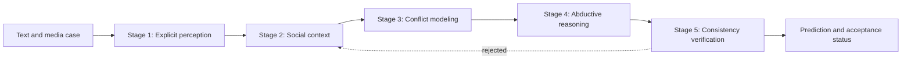

# MoCA: Implicit Social Context Analysis

MoCA is a multimodal benchmark and reference implementation for structured implicit social cognition reasoning. Given textual and audiovisual evidence, the task recovers **who** expresses **what** toward **whom**, together with the social mechanism through which the latent meaning is conveyed. MoCA covers three complementary scenarios: affection, intent, and stance.

This repository provides the benchmark annotations, reasoning contracts, prompt templates, data schemas, and representative multimodal cases. The corresponding media files are hosted in the [MoCA Hugging Face dataset](https://huggingface.co/datasets/z4722/Implicit_dataset).

**Resources:** [Benchmark annotations](data/datasetv3.18_hf_319_no_media_options.json) · [Hugging Face media](https://huggingface.co/datasets/z4722/Implicit_dataset) · [Pinned media snapshot](https://huggingface.co/datasets/z4722/Implicit_dataset/tree/170a5941118de47ec22bf5b7d5253cda25838c43)

## Overview

MoCA organizes implicit social reasoning into five stages:



1. **Explicit perception** records text and optional speech captions without assigning social meaning.
2. **Social context** formulates retrieval questions and organizes evidence into `fact`, `connection`, and `social_norm` fields.
3. **Conflict modeling** identifies the deviation between contextual expectation and explicit reality.
4. **Abductive reasoning** recovers the subject, target, mechanism, and latent label from the conflict.
5. **Consistency verification** checks evidence, context, and mechanism alignment. Rejected cases can be revisited for a configurable number of revision rounds.

The prompt contracts for these stages are defined in [`src/prompts.py`](src/prompts.py), and the pipeline orchestration is in [`src/pipeline.py`](src/pipeline.py).

## Benchmark data

The released annotation file, [`data/datasetv3.18_hf_319_no_media_options.json`](data/datasetv3.18_hf_319_no_media_options.json), contains **3,108** real-world multimodal instances. It is a lightweight annotation release: media locations and candidate-option sets are intentionally omitted from the JSON, while the corresponding image, video, and audio files are distributed through Hugging Face.

### Dataset composition

| Scenario | Image cases | Video cases | Total |
|---|---:|---:|---:|
| Affection | 650 | 286 | 936 |
| Intent | 900 | 279 | 1,179 |
| Stance (`attitude` in the released JSON) | 680 | 313 | 993 |
| **Total** | **2,230** | **878** | **3,108** |

The `attitude` scenario key in the annotation file corresponds to the **stance** scenario used in the paper and reasoning code. Map `attitude` to `stance` when passing released records to the pipeline.

### Annotation structure

Each record contains the input text, a four-component structured annotation, and diversity metadata:

```json
{
  "id": "affection_0001",
  "input": {
    "scenario": "affection",
    "text": "Example multimodal utterance"
  },
  "ground_truth": {
    "subject": "speaker",
    "target": "partner",
    "mechanism": "figurative semantics",
    "label": "disgusted"
  },
  "diversity": {
    "domain": "Online & Social Media",
    "culture": "General Culture"
  }
}
```

| Field | Description |
|---|---|
| `id` | Stable instance identifier used to associate annotations with media files. |
| `input.scenario` | Implicit social domain: `affection`, `intent`, or `attitude` (stance). |
| `input.text` | Textual component paired with the visual or audiovisual evidence. |
| `ground_truth.subject` | Social actor whose implicit state is being inferred. |
| `ground_truth.target` | Person, group, object, issue, or event toward which the state is directed. |
| `ground_truth.mechanism` | Expressive or socio-cognitive strategy that realizes the implicit meaning. |
| `ground_truth.label` | Scenario-specific latent social state. |
| `diversity.domain` | Social setting in which the interaction occurs. |
| `diversity.culture` | Cultural context associated with the instance. |

### Media access

The canonical media release is available at [`z4722/Implicit_dataset`](https://huggingface.co/datasets/z4722/Implicit_dataset). Files are organized by scenario and share the same identifier as the annotation record:

```text
<scenario>/image/<id>.png or <id>.jpg
<scenario>/video/<id>.mp4
<scenario>/Video_composition/audio_caption/<id>.mp3
```

The current media release contains 2,230 static images, 878 videos, and 878 associated audio files. Extracted-frame directories are not included. Because the lightweight JSON does not contain a media-type field, an instance can be paired by checking whether its `id` is present under the scenario's `image/` or `video/` directory.

## Repository structure

```text
MoCA/
├── data/                # Full lightweight benchmark annotations
│   └── datasetv3.18_hf_319_no_media_options.json
├── src/
│   ├── agents.py       # Agent specifications
│   ├── cli.py          # Command-line entry point
│   ├── pipeline.py     # Five-stage reasoning pipeline
│   ├── prompts.py      # Stage-specific instruction templates
│   ├── schemas.py      # Input, intermediate-artifact, and output schemas
│   ├── taxonomy.py     # Scenario-specific taxonomy definitions
│   └── tools.py        # Runtime utility helpers
├── samples/
│   └── samples.json    # Example cases covering affection, intent, and stance
└── sample_assets/
    ├── affection/      # Image examples
    ├── intent/         # Video/audio examples
    └── stance/         # Image and video/audio examples
```

## Pipeline case format

The reasoning pipeline accepts either a single JSON object or a JSON list. Unlike the lightweight benchmark annotations above, executable pipeline cases may include local media references and candidate subject/target options, as illustrated in [`samples/samples.json`](samples/samples.json):

```json
{
  "id": "demo_001",
  "input": {
    "scenario": "affection",
    "text": "when the bass drops just right"
  },
  "options": {
    "subject": ["poster", "photographer", "dancer"],
    "target": ["the bass drop", "dance move", "crowd reaction"]
  },
  "ground_truth": {
    "subject": "poster",
    "target": "the bass drop",
    "mechanism": "figurative_semantics",
    "label": "Happy"
  }
}
```

The schema accepts the following scenario values:

- `affection`
- `intent`
- `stance`

`ground_truth` is optional metadata and is parsed into the case object. Candidate `subject` and `target` lists define the structured output space for each case.
